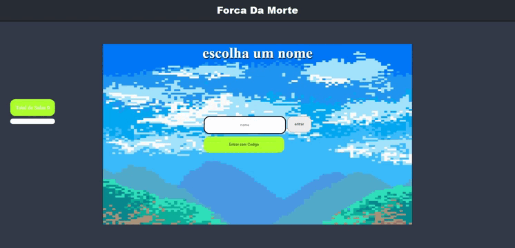

## 🚀 Tecnologias

- HTML
- CSS
- JavaScript
- NodeJS
- EJS
- Express
- Jquery
- Socket.io

💻 Projeto
Jogo da Forca da Morte,cada Jogador tem 3 letras sequenciais para acertar, 60s de Tempo para cada Jogada

## sobre 
Projeto com Proposito para Treinar Socket.io e Deploy no Heroku

## Imagens do Projeto
